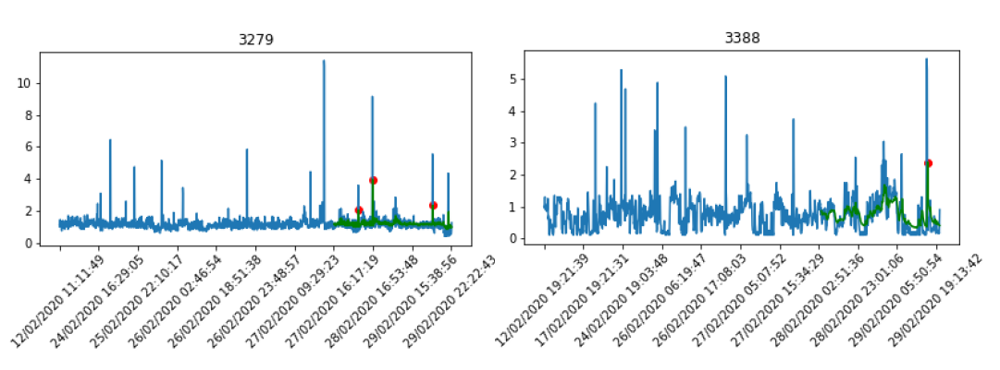
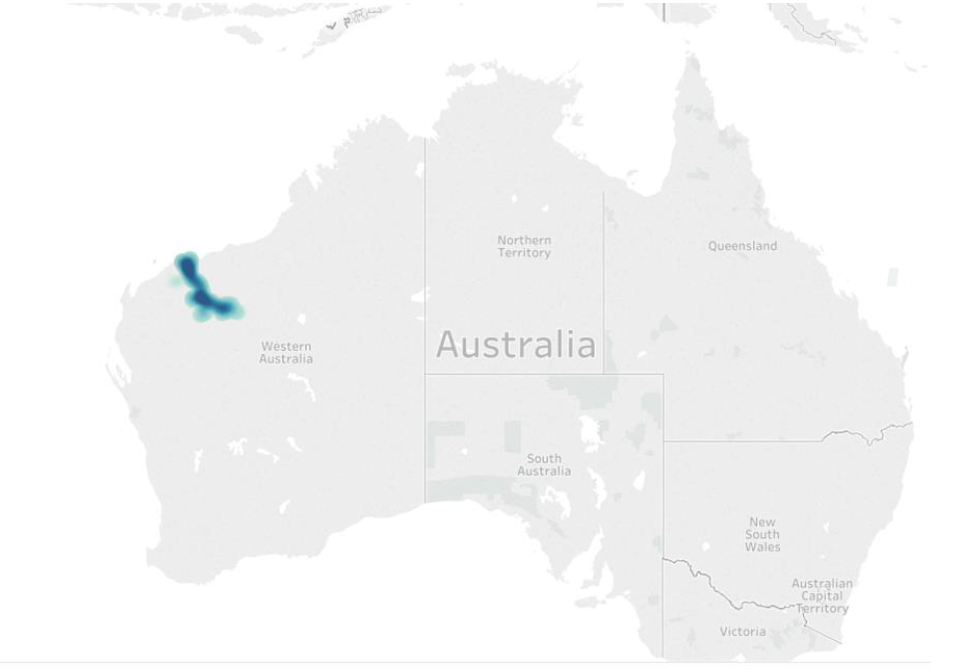
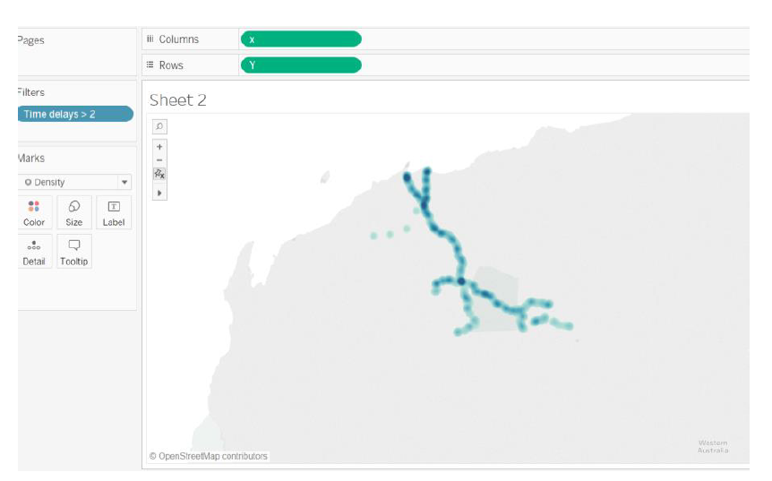

# Radio Network Anomaly Detection System

This project was started in February 2020 and was completed in October 2020. The main aim of the project was to detect anomalies in the radio signals in the radio-based communication systems used by Hitachi Rail STS to control and monitor trains in Australia. Balise groups are used to communicate in the radio-based communication systems. Time delays experienced by these balise groups were forecasted using time series and anomalies in the forecasts were highlighted. The anomalies were then visualized on the Australian map. The positions of the balise groups on the railway tracks experiencing anomalies were visualized using heatmap. The key insight was that the balise groups at railway junctions experienced high number of anomalies and these anomalies were recursive in nature.

The file 9th September conatins the code for reading, cleaning and exploring the data. It also contains the time series model and model evaluation. The notebook Visualization contains the visualizations of the forecasts and the anomalies. The file Tableau contains the code for combing the forecasted anomalies data along with the geo coordonates in order to build a heatmap on Tabeau.

## Few forecasts:

## Railway Track in Pilbara (Western Australia)

## Heatmap of Balise Groups

